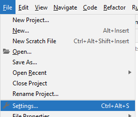
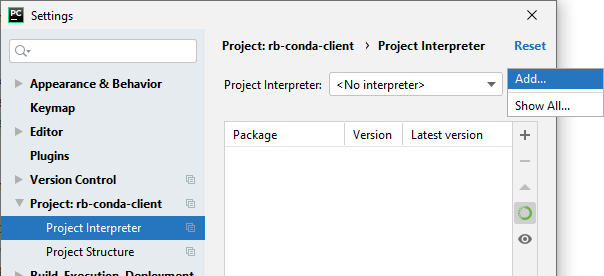
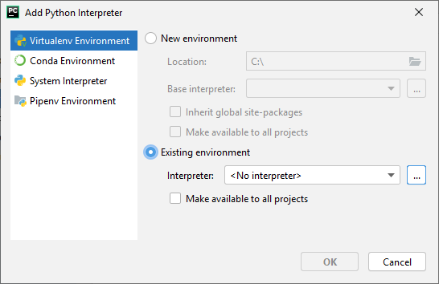
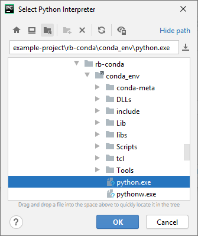

# Pycharm
Use the following steps to use a specific Conda environment as interpreter in PyCharm:

1. Make sure specific project is opened in Pycharm
1. Go to **File** > **Settings**  
   
1. On the left, go to **Project: \[project_name\]** > **Project Interpreter**
1. On the right, click on the little gear and select **Add**  
   
1. Select **Virtualenv Environment** on the left
1. Select **Existing environment**
1. If this environment needs to be shared across multiple projects, activate **Make available to all projects**
1. Click on the three dot's on the right  
   
1. Select `python.exe` in the (created) `.zwik/conda_env` directory next to `zwik_environment.yml`  
   Use the "folder-button" on the top to quickly go to the project directory.  
   
1. Close all dialogs by clicking **OK**
1. After closing the last dialog, PyCharm will probably start indexing your project using the new interpreter.  
   This can take a while!
   After this is completed, you can run your scripts and code completion according to your environment.
